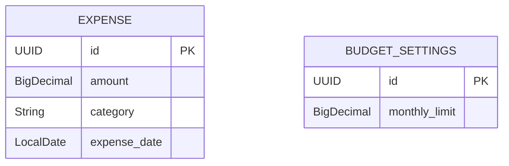

# Expense Tracker - Requirements Specification

This document details the functional, non-functional, and technical requirements for the Expense Tracker application.

---

## 1. Project Overview
The **Expense Tracker** is a self-hosted, single-user web application designed to help individuals track their daily expenses, view visual spend summaries, and manage a monthly budget. The goal is to provide a clean, fast, and visually appealing experience with zero unnecessary authentication overhead.

---

## 2. User Roles & Scope
- **Single-User Application**: 
  - There are no user accounts, registration, or login procedures.
  - Anyone accessing the application interacts with the same dataset.
  - Ideal for local/self-hosted deployment.

---

## 3. Functional Requirements

### 3.1. Expense Management (CRUD)
The system must support basic management of expense entries with a minimalist set of fields:
- **Fields per Expense**:
  - **Amount**: Positive decimal value (required).
  - **Category**: Text field (required). Common defaults: *Food, Transport, Utilities, Entertainment, Shopping, Others*.
  - **Date**: Date value (required, defaults to current date, user-editable).
- **Operations**:
  - **Create**: A user-friendly form to add a new expense.
  - **Read**: A tabular or list view displaying all recorded expenses (paginated or scrollable).
  - **Update**: Ability to edit existing expense records (Amount, Category, Date).
  - **Delete**: Ability to delete an expense with a confirmation prompt.

### 3.2. Filtering & Search
- **Category Filter**: Filter the displayed expenses by a specific category.
- **Month/Year Filter**: Filter the displayed expenses to show only those matching a specific month and year.

### 3.3. Budget Management
- **Single Monthly Budget**:
  - The user can configure a single monthly budget limit (e.g., $1,500).
  - A persistent settings configuration stores this budget limit.
- **Budget Tracking & Alerts**:
  - Display a visual progress bar indicating the percentage of the current month's budget spent.
  - Change colors dynamically based on budget consumption:
    - **Safe (Green/Blue)**: < 80% spent.
    - **Warning (Yellow/Orange)**: 80% - 99% spent.
    - **Over Budget (Red)**: >= 100% spent.

### 3.4. Dashboard & Visualizations
- **Summary Metrics**:
  - Total amount spent (overall).
  - Total amount spent in the current calendar month.
  - Remaining budget for the current month.
- **Visual Charts**:
  - **Category Breakdown Chart**: A pie or donut chart representing the share of expenses per category for the selected month/period.
  - **Monthly Trend Chart**: A bar or line chart showing expense trends over recent months.

---

## 4. User Interface & Experience (UI/UX)
- **Responsive Single-Page Application (SPA)**: The app should load on a single page, dynamically updating components without full page reloads.
- **Theme Toggle**:
  - Supports switching between **Light Mode** and **Dark Mode**.
  - Persists the selected theme in the browser's local storage to remember user preference.
- **Rich Aesthetics**:
  - Modern typography (e.g., using Google Fonts).
  - Curated, premium color palette with gradients and smooth transitions.
  - Subtle micro-animations on interactive components (buttons, links, form inputs).
  - Clean card-based layouts and glassmorphism elements.

---

## 5. Technical Stack

### 5.1. Frontend
- **HTML5**: Semantic markup.
- **Vanilla CSS3**: Styling, layout (Flexbox/Grid), custom animations, CSS variables for theme toggling (no CSS frameworks like TailwindCSS).
- **Vanilla JavaScript (ES6+)**: SPA routing/rendering, API communication (`fetch`), interactive state management, and chart rendering (using a lightweight charting library like Chart.js via CDN).

### 5.2. Backend
- **Java Spring Boot 3.x**: Restful API framework.
- **Java 21**: Latest LTS version.
- **Maven**: Build automation and dependency management.
- **Dependencies**: Spring Web, Spring Data JPA, Lombok (for boilerplate reduction), and PostgreSQL Driver.

### 5.3. Database & Infrastructure
- **PostgreSQL**: Relational database.
- **Docker**: The PostgreSQL instance will run inside a Docker container for ease of setup and portability.

---

## 6. Draft Database Schema

