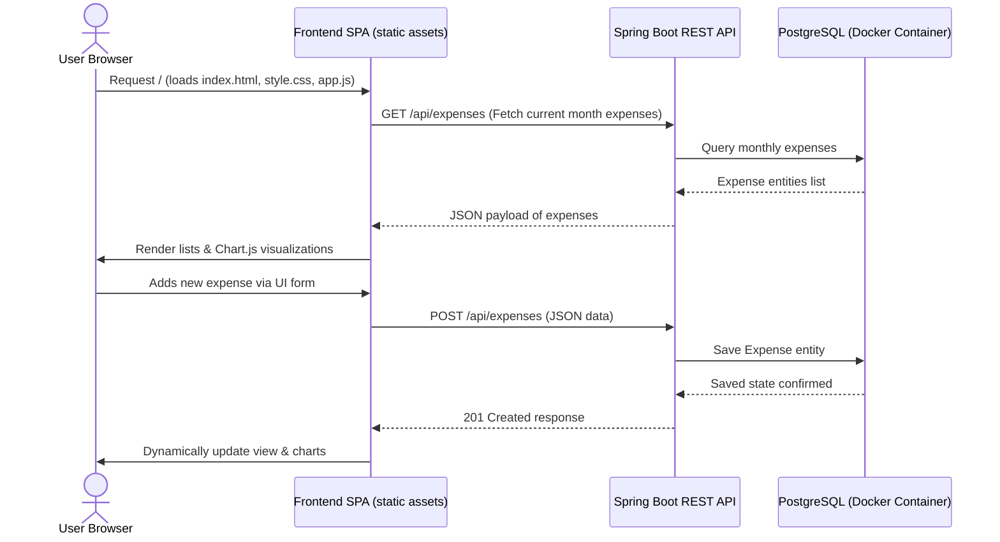

# Technical Architecture - Expense Tracker

This document details the technical architecture, technology stack, database schema, containerization strategy, and file/folder layout for the self-hosted Expense Tracker application.

---

## 1. Technology Stack

### 1.1. Frontend (Client-side)
*   **HTML5**: Standard semantic structure.
*   **CSS3**: Flexbox and Grid layouts, CSS Custom Properties (Variables) for theme management (Light/Dark mode), and custom keyframe transitions.
*   **JavaScript (ES6+)**: SPA state management, routing, event-handling, and HTTP communication using `fetch` API.
*   **Chart.js**: Rendered via CDN for responsive, interactive spending trends and category distribution charts.

### 1.2. Backend (Server-side)
*   **Java 21**: JDK 21 LTS version.
*   **Spring Boot 3.x**: Core framework (Spring MVC for REST API, Spring Data JPA for data access).
*   **Lombok**: Compilation-time annotation library to eliminate getter, setter, constructor, and builder boilerplate.
*   **PostgreSQL JDBC Driver**: Driver for PostgreSQL database connectivity.
*   **Hibernate ORM**: Used for database schema synchronization (`spring.jpa.hibernate.ddl-auto=update`).

### 1.3. Database & Local Development
*   **PostgreSQL**: Relational database for storing expenses and configuration settings.
*   **Docker**: Containerized PostgreSQL instance for quick local setup, ensuring zero local PostgreSQL installation overhead.

---

## 2. Directory & Package Layout

The application will be structured as a standard Maven-based Spring Boot project. The frontend files will be hosted directly within the static resource folder of the backend to facilitate easy single-artifact packaging.

```text
expense-tracker/
├── docker-compose.yml
├── pom.xml
└── src/
    └── main/
        ├── java/
        │   └── com/
        │       └── expensetracker/
        │           ├── ExpenseTrackerApplication.java
        │           ├── config/
        │           │   └── BudgetConfig.java
        │           ├── controller/
        │           │   ├── BudgetController.java
        │           │   └── ExpenseController.java
        │           ├── entity/
        │           │   ├── BudgetSettings.java
        │           │   └── Expense.java
        │           ├── repository/
        │           │   ├── BudgetSettingsRepository.java
        │           │   └── ExpenseRepository.java
        │           └── service/
        │               ├── BudgetService.java
        │               └── ExpenseService.java
        └── resources/
            ├── application.properties
            └── static/
                ├── index.html
                ├── css/
                │   └── style.css
                └── js/
                    └── app.js
```

---

## 3. Data Storage & Schema Design

As resolved during the requirement specification, Hibernate's `ddl-auto=update` will be used to manage the schema dynamically on startup.

### 3.1. Entity: `Expense`
Represents an individual transaction entry.

| Column | Data Type | Constraints | Description |
| :--- | :--- | :--- | :--- |
| `id` | `UUID` | Primary Key | Unique identifier (UUID) for each expense record |
| `amount` | `NUMERIC(12, 2)` | NOT NULL | The cost of the expense |
| `category` | `VARCHAR(100)` | NOT NULL | Category classification (e.g., Food, Utilities) |
| `expense_date` | `DATE` | NOT NULL | Date when the expense occurred |

### 3.2. Entity: `BudgetSettings`
Represents application-wide budget configuration. Since it's a single-user app, only one record will reside in this table (configured with a fixed UUID, e.g., `00000000-0000-0000-0000-000000000000`).

| Column | Data Type | Constraints | Description |
| :--- | :--- | :--- | :--- |
| `id` | `UUID` | Primary Key | Fixed UUID representation of the settings entity |
| `monthly_limit` | `NUMERIC(12, 2)` | NOT NULL | Target monthly spending budget limit |

---

## 4. Docker Environment Configuration

A single `docker-compose.yml` file is configured at the root of the project to spin up a PostgreSQL instance. The Spring Boot backend runs locally and connects to this container.

### `docker-compose.yml`
```yaml
version: '3.8'

services:
  postgres-db:
    image: postgres:16-alpine
    container_name: expense-tracker-db
    environment:
      POSTGRES_DB: expensetracker
      POSTGRES_USER: admin
      POSTGRES_PASSWORD: admin
    ports:
      - "5432:5432"
    volumes:
      - pgdata:/var/lib/postgresql/data

volumes:
  pgdata:
```

### Spring Boot Database Properties (`application.properties`)
```properties
spring.datasource.url=jdbc:postgresql://localhost:5432/expensetracker
spring.datasource.username=admin
spring.datasource.password=admin
spring.datasource.driver-class-name=org.postgresql.Driver

spring.jpa.hibernate.ddl-auto=update
spring.jpa.show-sql=true
spring.jpa.properties.hibernate.dialect=org.hibernate.dialect.PostgreSQLDialect
```

---

## 5. Architectural Communication Flow

The app operates as a single self-contained application where the user browser interacts with the static frontend web page, which makes REST API calls to the local Spring Boot backend.


