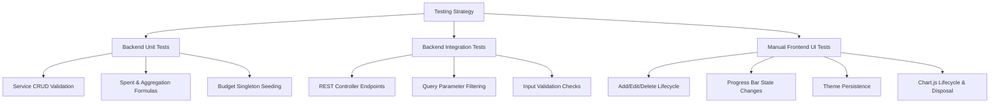

# Testing Plan & Verification Guide - Expense Tracker

This document details the testing strategy, test coverage, and step-by-step verification plan for the self-hosted **Expense Tracker** application. It aligns with the functional requirements, API contracts, architectural designs, and implementation specifications.

---

## 1. Testing Strategy Overview

The testing strategy is designed to validate all layers of the single-user, self-hosted Expense Tracker application. Since it operates in a local/self-hosted environment with zero authentication overhead, our testing focuses on core business calculations, input validation integrity, API routing correctness, and UI responsiveness.



### 1.1. Testing Scopes

| Scope | Layer | Target Components | Core Tools / Technologies | Objective |
| :--- | :--- | :--- | :--- | :--- |
| **Unit Testing** | Service Layer | `ExpenseService`, `BudgetService` | JUnit 5, Mockito, AssertJ | Validate business logic, calculation formulas, and default state seeding while isolating database dependencies. |
| **Integration Testing** | Web Controller Layer | `ExpenseController`, `BudgetController`, `GlobalExceptionHandler` | Spring Boot Test, `MockMvc`, Jackson | Validate REST endpoints, serialization, validation constraints, query parameters, and structured error responses. |
| **Manual Verification** | Client SPA Layer | `index.html`, `style.css`, `app.js`, Chart.js | Chrome DevTools, LocalStorage, Browser | Validate user interaction, SPA navigation views, dynamic CSS variable theme toggles, progress bar color thresholds, and Chart.js canvas disposal. |

---

## 2. Backend Unit Tests (Service Layer)

Unit tests focus on validating service-level logic. Repository dependencies are mocked using Mockito to isolate tests from database transactions.

### 2.1. ExpenseService Unit Tests
- **CRUD Operations**: Validates that creation, retrieval, updates, and deletions invoke correct repository queries.
- **Aggregation Logic**: Tests standard calculations for total spent overall, spent in the current month, remaining budget, and category grouping percentages.
- **Specifications & Filters**: Verifies helper logic for building dynamic JPA query specifications.

### 2.2. BudgetService Unit Tests
- **Singleton Settings Record**: Verifies that the singleton ID (`00000000-0000-0000-0000-000000000000`) is used to retrieve and write configurations.
- **Default Budget Seeding**: Asserts that if no budget settings row is present on startup or retrieval, a default budget limit of `$1000.00` is automatically seeded and returned.

### 2.3. Java Service Test Implementation (`ExpenseServiceTest.java`)

```java
package com.expensetracker.service;

import com.expensetracker.dto.CategorySumDto;
import com.expensetracker.dto.SummaryDto;
import com.expensetracker.entity.BudgetSettings;
import com.expensetracker.entity.Expense;
import com.expensetracker.repository.ExpenseRepository;
import org.junit.jupiter.api.BeforeEach;
import org.junit.jupiter.api.DisplayName;
import org.junit.jupiter.api.Test;
import org.junit.jupiter.api.extension.ExtendWith;
import org.mockito.InjectMocks;
import org.mockito.Mock;
import org.mockito.junit.jupiter.MockitoExtension;
import org.springframework.data.domain.Sort;
import org.springframework.data.jpa.domain.Specification;

import java.math.BigDecimal;
import java.time.LocalDate;
import java.time.YearMonth;
import java.util.*;

import static org.assertj.core.api.Assertions.assertThat;
import static org.assertj.core.api.Assertions.assertThatThrownBy;
import static org.mockito.ArgumentMatchers.any;
import static org.mockito.Mockito.*;

@ExtendWith(MockitoExtension.class)
public class ExpenseServiceTest {

    @Mock
    private ExpenseRepository expenseRepository;

    @Mock
    private BudgetService budgetService;

    @InjectMocks
    private ExpenseService expenseService;

    private UUID sampleId;
    private Expense sampleExpense;

    @BeforeEach
    void setUp() {
        sampleId = UUID.randomUUID();
        sampleExpense = Expense.builder()
                .id(sampleId)
                .amount(new BigDecimal("75.50"))
                .category("Food")
                .expenseDate(LocalDate.now())
                .build();
    }

    @Test
    @DisplayName("Create Expense should save and return the expense entity")
    void testCreateExpense() {
        when(expenseRepository.save(any(Expense.class))).thenReturn(sampleExpense);

        Expense saved = expenseService.createExpense(sampleExpense);

        assertThat(saved).isNotNull();
        assertThat(saved.getId()).isEqualTo(sampleId);
        assertThat(saved.getAmount()).isEqualTo(new BigDecimal("75.50"));
        verify(expenseRepository, times(1)).save(sampleExpense);
    }

    @Test
    @DisplayName("Update Expense should modify existing details and save")
    void testUpdateExpense_Success() {
        Expense updatedDetails = Expense.builder()
                .amount(new BigDecimal("100.00"))
                .category("Utilities")
                .expenseDate(LocalDate.now())
                .build();

        when(expenseRepository.findById(sampleId)).thenReturn(Optional.of(sampleExpense));
        when(expenseRepository.save(any(Expense.class))).thenAnswer(i -> i.getArgument(0));

        Expense result = expenseService.updateExpense(sampleId, updatedDetails);

        assertThat(result.getAmount()).isEqualTo(new BigDecimal("100.00"));
        assertThat(result.getCategory()).isEqualTo("Utilities");
        verify(expenseRepository, times(1)).findById(sampleId);
        verify(expenseRepository, times(1)).save(any(Expense.class));
    }

    @Test
    @DisplayName("Update Expense should throw NoSuchElementException if record is missing")
    void testUpdateExpense_NotFound() {
        when(expenseRepository.findById(sampleId)).thenReturn(Optional.empty());

        assertThatThrownBy(() -> expenseService.updateExpense(sampleId, sampleExpense))
                .isInstanceOf(NoSuchElementException.class)
                .hasMessageContaining("Expense not found with ID: " + sampleId);
    }

    @Test
    @DisplayName("Delete Expense should remove record if it exists")
    void testDeleteExpense_Success() {
        when(expenseRepository.existsById(sampleId)).thenReturn(true);
        doNothing().when(expenseRepository).deleteById(sampleId);

        expenseService.deleteExpense(sampleId);

        verify(expenseRepository, times(1)).existsById(sampleId);
        verify(expenseRepository, times(1)).deleteById(sampleId);
    }

    @Test
    @DisplayName("Delete Expense should throw NoSuchElementException if record does not exist")
    void testDeleteExpense_NotFound() {
        when(expenseRepository.existsById(sampleId)).thenReturn(false);

        assertThatThrownBy(() -> expenseService.deleteExpense(sampleId))
                .isInstanceOf(NoSuchElementException.class)
                .hasMessageContaining("Expense not found with ID: " + sampleId);
    }

    @Test
    @DisplayName("Get Summary should calculate correct statistics and percentages")
    void testGetSummary() {
        LocalDate today = LocalDate.now();
        YearMonth currentMonth = YearMonth.from(today);
        LocalDate start = currentMonth.atDay(1);
        LocalDate end = currentMonth.atEndOfMonth();

        BigDecimal mockTotalSpend = new BigDecimal("3500.00");
        BigDecimal mockMonthSpend = new BigDecimal("500.00");
        BudgetSettings mockBudget = new BudgetSettings(BudgetService.BUDGET_ID, new BigDecimal("1000.00"));

        when(expenseRepository.sumAllExpenses()).thenReturn(mockTotalSpend);
        when(expenseRepository.sumExpensesBetween(start, end)).thenReturn(mockMonthSpend);
        when(budgetService.getBudgetSettings()).thenReturn(mockBudget);

        SummaryDto summary = expenseService.getSummary();

        assertThat(summary.getTotalSpend()).isEqualTo(mockTotalSpend);
        assertThat(summary.getCurrentMonthSpend()).isEqualTo(mockMonthSpend);
        assertThat(summary.getBudgetLimit()).isEqualTo(new BigDecimal("1000.00"));
        assertThat(summary.getRemainingBudget()).isEqualTo(new BigDecimal("500.00"));
        assertThat(summary.getBudgetPercentage()).isEqualTo(new BigDecimal("50.00"));
    }
}
```

### 2.4. Java Service Test Implementation (`BudgetServiceTest.java`)

```java
package com.expensetracker.service;

import com.expensetracker.entity.BudgetSettings;
import com.expensetracker.repository.BudgetSettingsRepository;
import org.junit.jupiter.api.DisplayName;
import org.junit.jupiter.api.Test;
import org.junit.jupiter.api.extension.ExtendWith;
import org.mockito.InjectMocks;
import org.mockito.Mock;
import org.mockito.junit.jupiter.MockitoExtension;

import java.math.BigDecimal;
import java.util.Optional;

import static org.assertj.core.api.Assertions.assertThat;
import static org.mockito.ArgumentMatchers.any;
import static org.mockito.Mockito.*;

@ExtendWith(MockitoExtension.class)
public class BudgetServiceTest {

    @Mock
    private BudgetSettingsRepository budgetSettingsRepository;

    @InjectMocks
    private BudgetService budgetService;

    @Test
    @DisplayName("Get Budget Settings should retrieve configuration when record exists")
    void testGetBudgetSettings_WhenExists() {
        BudgetSettings expected = new BudgetSettings(BudgetService.BUDGET_ID, new BigDecimal("1500.00"));
        when(budgetSettingsRepository.findById(BudgetService.BUDGET_ID)).thenReturn(Optional.of(expected));

        BudgetSettings actual = budgetService.getBudgetSettings();

        assertThat(actual).isNotNull();
        assertThat(actual.getId()).isEqualTo(BudgetService.BUDGET_ID);
        assertThat(actual.getMonthlyLimit()).isEqualTo(new BigDecimal("1500.00"));
        verify(budgetSettingsRepository, never()).save(any(BudgetSettings.class));
    }

    @Test
    @DisplayName("Get Budget Settings should seed and return default config if none exists")
    void testGetBudgetSettings_WhenNotExistsSeedsDefault() {
        when(budgetSettingsRepository.findById(BudgetService.BUDGET_ID)).thenReturn(Optional.empty());
        when(budgetSettingsRepository.save(any(BudgetSettings.class))).thenAnswer(i -> i.getArgument(0));

        BudgetSettings seeded = budgetService.getBudgetSettings();

        assertThat(seeded).isNotNull();
        assertThat(seeded.getId()).isEqualTo(BudgetService.BUDGET_ID);
        assertThat(seeded.getMonthlyLimit()).isEqualTo(new BigDecimal("1000.00"));
        verify(budgetSettingsRepository, times(1)).save(any(BudgetSettings.class));
    }

    @Test
    @DisplayName("Update Budget should retrieve, modify, and save the settings singleton")
    void testUpdateBudgetSettings() {
        BudgetSettings existing = new BudgetSettings(BudgetService.BUDGET_ID, new BigDecimal("1000.00"));
        when(budgetSettingsRepository.findById(BudgetService.BUDGET_ID)).thenReturn(Optional.of(existing));
        when(budgetSettingsRepository.save(any(BudgetSettings.class))).thenAnswer(i -> i.getArgument(0));

        BudgetSettings updated = budgetService.updateBudgetSettings(new BigDecimal("1800.00"));

        assertThat(updated.getMonthlyLimit()).isEqualTo(new BigDecimal("1800.00"));
        verify(budgetSettingsRepository, times(1)).save(existing);
    }
}
```

---

## 3. Backend Integration Tests (REST API Layer)

Integration tests verify that routing, HTTP verbs, content serialization (JSON), parameter binding, and request body validations perform correctly. We use MockMvc to execute HTTP queries against controller endpoints without spawning a full web container.

### 3.1. Tested Endpoints & Scenarios
- `POST /api/expenses`: Validates field presence, positive amount constraint, and category non-blank rules. Ensures invalid requests return a HTTP 400 Bad Request.
- `GET /api/expenses`: Verifies query parsing for category and date values, ensuring correct parameter passing to the service specifications.
- `GET /api/expenses/stats/summary`: Asserts that JSON payloads containing aggregate metrics match requirements.
- `PUT /api/budget-settings`: Verifies that updating the budget updates the single active config and enforces validation on empty or negative limits.

### 3.2. Spring MVC Integration Test (`ExpenseControllerTest.java`)

```java
package com.expensetracker.controller;

import com.fasterxml.jackson.databind.ObjectMapper;
import com.expensetracker.entity.Expense;
import com.expensetracker.service.ExpenseService;
import org.junit.jupiter.api.DisplayName;
import org.junit.jupiter.api.Test;
import org.springframework.beans.factory.annotation.Autowired;
import org.springframework.boot.test.autoconfigure.web.servlet.WebMvcTest;
import org.springframework.boot.test.mock.mockito.MockBean;
import org.springframework.http.MediaType;
import org.springframework.test.web.servlet.MockMvc;

import java.math.BigDecimal;
import java.time.LocalDate;
import java.util.Collections;
import java.util.UUID;

import static org.mockito.ArgumentMatchers.any;
import static org.mockito.ArgumentMatchers.eq;
import static org.mockito.Mockito.when;
import static org.springframework.test.web.servlet.request.MockMvcRequestBuilders.get;
import static org.springframework.test.web.servlet.request.MockMvcRequestBuilders.post;
import static org.springframework.test.web.servlet.result.MockMvcResultMatchers.jsonPath;
import static org.springframework.test.web.servlet.result.MockMvcResultMatchers.status;

@WebMvcTest(ExpenseController.class)
public class ExpenseControllerTest {

    @Autowired
    private MockMvc mockMvc;

    @MockBean
    private ExpenseService expenseService;

    @Autowired
    private ObjectMapper objectMapper;

    @Test
    @DisplayName("POST /api/expenses should return 201 Created when payload is valid")
    void testCreateExpense_ValidRequest() throws Exception {
        Expense requestBody = Expense.builder()
                .amount(new BigDecimal("45.00"))
                .category("Entertainment")
                .expenseDate(LocalDate.of(2026, 6, 10))
                .build();

        Expense savedRecord = Expense.builder()
                .id(UUID.randomUUID())
                .amount(new BigDecimal("45.00"))
                .category("Entertainment")
                .expenseDate(LocalDate.of(2026, 6, 10))
                .build();

        when(expenseService.createExpense(any(Expense.class))).thenReturn(savedRecord);

        mockMvc.perform(post("/api/expenses")
                .contentType(MediaType.APPLICATION_JSON)
                .content(objectMapper.writeValueAsString(requestBody)))
                .andExpect(status().isCreated())
                .andExpect(jsonPath("$.id").exists())
                .andExpect(jsonPath("$.amount").value(45.00))
                .andExpect(jsonPath("$.category").value("Entertainment"))
                .andExpect(jsonPath("$.expenseDate").value("2026-06-10"));
    }

    @Test
    @DisplayName("POST /api/expenses should return 400 Bad Request if expense amount is negative")
    void testCreateExpense_ValidationFails_NegativeAmount() throws Exception {
        Expense invalidBody = Expense.builder()
                .amount(new BigDecimal("-10.00"))
                .category("Entertainment")
                .expenseDate(LocalDate.now())
                .build();

        mockMvc.perform(post("/api/expenses")
                .contentType(MediaType.APPLICATION_JSON)
                .content(objectMapper.writeValueAsString(invalidBody)))
                .andExpect(status().isBadRequest())
                .andExpect(jsonPath("$.status").value(400))
                .andExpect(jsonPath("$.error").value("Bad Request"))
                .andExpect(jsonPath("$.message").value(org.hamcrest.Matchers.containsString("Expense amount must be greater than zero")));
    }

    @Test
    @DisplayName("POST /api/expenses should return 400 Bad Request if category is blank")
    void testCreateExpense_ValidationFails_BlankCategory() throws Exception {
        Expense invalidBody = Expense.builder()
                .amount(new BigDecimal("12.50"))
                .category("")
                .expenseDate(LocalDate.now())
                .build();

        mockMvc.perform(post("/api/expenses")
                .contentType(MediaType.APPLICATION_JSON)
                .content(objectMapper.writeValueAsString(invalidBody)))
                .andExpect(status().isBadRequest())
                .andExpect(jsonPath("$.status").value(400))
                .andExpect(jsonPath("$.message").value(org.hamcrest.Matchers.containsString("Category must not be blank")));
    }

    @Test
    @DisplayName("GET /api/expenses should support category and monthYear parameters")
    void testGetExpenses_WithFilters() throws Exception {
        when(expenseService.getExpenses(eq("Food"), eq("2026-06"))).thenReturn(Collections.emptyList());

        mockMvc.perform(get("/api/expenses")
                .param("category", "Food")
                .param("monthYear", "2026-06"))
                .andExpect(status().isOk())
                .andExpect(status().isOk());
    }
}
```

### 3.3. Spring MVC Integration Test (`BudgetControllerTest.java`)

```java
package com.expensetracker.controller;

import com.fasterxml.jackson.databind.ObjectMapper;
import com.expensetracker.entity.BudgetSettings;
import com.expensetracker.service.BudgetService;
import org.junit.jupiter.api.DisplayName;
import org.junit.jupiter.api.Test;
import org.springframework.beans.factory.annotation.Autowired;
import org.springframework.boot.test.autoconfigure.web.servlet.WebMvcTest;
import org.springframework.boot.test.mock.mockito.MockBean;
import org.springframework.http.MediaType;
import org.springframework.test.web.servlet.MockMvc;

import java.math.BigDecimal;
import java.util.HashMap;
import java.util.Map;

import static org.mockito.ArgumentMatchers.any;
import static org.mockito.Mockito.when;
import static org.springframework.test.web.servlet.request.MockMvcRequestBuilders.get;
import static org.springframework.test.web.servlet.request.MockMvcRequestBuilders.put;
import static org.springframework.test.web.servlet.result.MockMvcResultMatchers.jsonPath;
import static org.springframework.test.web.servlet.result.MockMvcResultMatchers.status;

@WebMvcTest(BudgetController.class)
public class BudgetControllerTest {

    @Autowired
    private MockMvc mockMvc;

    @MockBean
    private BudgetService budgetService;

    @Autowired
    private ObjectMapper objectMapper;

    @Test
    @DisplayName("GET /api/budget-settings should return the active budget configuration")
    void testGetBudgetSettings() throws Exception {
        BudgetSettings config = new BudgetSettings(BudgetService.BUDGET_ID, new BigDecimal("1200.00"));
        when(budgetService.getBudgetSettings()).thenReturn(config);

        mockMvc.perform(get("/api/budget-settings"))
                .andExpect(status().isOk())
                .andExpect(jsonPath("$.id").value("00000000-0000-0000-0000-000000000000"))
                .andExpect(jsonPath("$.monthlyLimit").value(1200.00));
    }

    @Test
    @DisplayName("PUT /api/budget-settings should update configurations with positive amounts")
    void testUpdateBudgetSettings_Success() throws Exception {
        BudgetSettings updatedConfig = new BudgetSettings(BudgetService.BUDGET_ID, new BigDecimal("1500.00"));
        when(budgetService.updateBudgetSettings(any(BigDecimal.class))).thenReturn(updatedConfig);

        Map<String, Object> requestBody = new HashMap<>();
        requestBody.put("monthlyLimit", 1500.00);

        mockMvc.perform(put("/api/budget-settings")
                .contentType(MediaType.APPLICATION_JSON)
                .content(objectMapper.writeValueAsString(requestBody)))
                .andExpect(status().isOk())
                .andExpect(jsonPath("$.monthlyLimit").value(1500.00));
    }

    @Test
    @DisplayName("PUT /api/budget-settings should return 400 Bad Request if monthly limit parameter is missing")
    void testUpdateBudgetSettings_MissingParameter() throws Exception {
        Map<String, Object> requestBody = new HashMap<>(); // Empty parameters

        mockMvc.perform(put("/api/budget-settings")
                .contentType(MediaType.APPLICATION_JSON)
                .content(objectMapper.writeValueAsString(requestBody)))
                .andExpect(status().isBadRequest())
                .andExpect(jsonPath("$.message").value(org.hamcrest.Matchers.containsString("Field 'monthlyLimit' is required")));
    }
}
```

---

## 4. Frontend Verification & Manual Test Cases

To verify that the frontend functions as a rich, single-page application without rendering defects, execute the following manual tests inside a standard web browser.

> [!IMPORTANT]
> Verify that the PostgreSQL database container (`expense-tracker-db`) is active (`docker ps`) and the Spring Boot application server is running locally on port `8080` before executing these tests.

### Test Group 1: CRUD & View Navigation Integrity
| Test Case ID | Test Objective | Execution Steps | Expected Behavior |
| :--- | :--- | :--- | :--- |
| **UI-TC-01** | SPA View Transitions | 1. Load `http://localhost:8080`. <br>2. Click 'Expenses' in navigation header.<br>3. Click 'Settings' in navigation header. | - The page switches views without reloading. <br>- View changes toggle the `.hidden` CSS class.<br>- Active nav links are highlighted (`active` class). |
| **UI-TC-02** | Add New Expense | 1. Navigate to Expenses log view.<br>2. Click `+ Add Expense` to open the modal overlay.<br>3. Fill in Amount: `45.00`, Category: `Entertainment`, Date: `2026-06-10`. Click `Save Expense`. | - The modal closes.<br>- A row containing the expense details is dynamically appended.<br>- The transaction row has a `data-id` attribute bound with a valid UUID. |
| **UI-TC-03** | Edit Existing Expense | 1. Click the `Edit` button on the newly created row.<br>2. Change Amount to `55.00` and Category to `Shopping`. Click `Save Expense`. | - The modal displays title "Edit Expense" with fields pre-populated.<br>- The row values update in place without reloading.<br>- The database is successfully updated via `PUT /api/expenses/{uuid}`. |
| **UI-TC-04** | Delete Expense | 1. Click the `Delete` button on an expense row.<br>2. Select `Cancel` on prompt. Confirm item remains.<br>3. Click `Delete` again, select `OK` on prompt. | - The transaction row runs the `.fade-out` CSS animation (0.3 seconds transition).<br>- The row is removed from the DOM.<br>- A request is sent: `DELETE /api/expenses/{uuid}`. |

---

### Test Group 2: Dynamic Budget Indicators & Color Transitions
The progress bar fill updates dynamically and changes styling classes based on consumption ratios.

$$\text{Spent Ratio} = \left( \frac{\text{Current Month Spent}}{\text{Monthly Limit}} \right) \times 100$$

```text
  [Safe State: <80%]
  ========================================------------------------- (Green/Blue Gradient)
  
  [Warning State: 80% to 99.9%]
  ============================================================----- (Amber Orange Color)
  
  [Critical Overflow: >=100%]
  ================================================================= (Rose Red Color + Banner Alert)
```

| Test Case ID | Test Objective | Execution Steps | Expected Behavior |
| :--- | :--- | :--- | :--- |
| **UI-TC-05** | Budget Configuration | 1. Navigate to Settings page.<br>2. Verify standard seeded limit defaults to `$1000.00`.<br>3. Enter `500.00` and click `Save Config`. | - Config saves successfully.<br>- User is redirected to the Dashboard.<br>- Remaining calculations update relative to $500.00. |
| **UI-TC-06** | Safe State Styling | 1. Ensure current month expenses total **less than 80%** of limit (e.g., spent `$150.00` of `$500.00` limit, or 30%). | - Progress bar is filled with the green-blue gradient (`bg-safe`).<br>- Status card displays metrics clearly.<br>- No global alert banner is visible. |
| **UI-TC-07** | Warning State Styling | 1. Add an expense that shifts total spending to **between 80% and 99.9%** (e.g., spent `$410.00` of `$500.00` limit, or 82%). | - Progress bar color changes dynamically to orange (`bg-warning`).<br>- Fill width updates smoothly (CSS transition).<br>- No global alert banner is visible. |
| **UI-TC-08** | Over-Budget State Styling | 1. Add an expense that increases total monthly spending to **100% or greater** (e.g., spent `$520.00` of `$500.00` limit, or 104%). | - Progress bar changes color to solid rose red (`bg-critical`).<br>- The progress bar fill remains pinned at 100% width.<br>- The red `#global-alert-banner` notification displays at the top of the viewport. |

---

### Test Group 3: Interface Theme Toggle & Storage Persistence
Theme transitions are handled by updating variables declared on the document root element.

| Test Case ID | Test Objective | Execution Steps | Expected Behavior |
| :--- | :--- | :--- | :--- |
| **UI-TC-09** | Switch to Dark Theme | 1. Click the SVG Moon/Sun toggle button (`#theme-toggle-btn`) in header. | - The `data-theme="dark"` attribute is added to the `<html>` element.<br>- Colors adapt to dark variables (gradient transitions are smooth).<br>- Toggle button changes to the alternative theme representation. |
| **UI-TC-10** | Theme Local Persistence | 1. Enable Dark Theme.<br>2. Open browser DevTools (`F12`), select Application -> Local Storage.<br>3. Verify key: `theme` is set to value `dark`.<br>4. Refresh the page. | - The local storage updates immediately.<br>- Upon reloading, the page opens in Dark Mode directly.<br>- No flash of white light occurs (Light mode styled layout doesn't load momentarily). |

---

### Test Group 4: Chart.js Canvas Lifecycle Verification
Any existing Chart instance must be disposed of before rendering updated data to prevent layout duplication and canvas hover anomalies.

| Test Case ID | Test Objective | Execution Steps | Expected Behavior |
| :--- | :--- | :--- | :--- |
| **UI-TC-11** | Donut Chart Hover Test | 1. Hover mouse pointer over category segments in the Doughnut Chart. | - Segment size expands slightly on hover (default Chart.js interaction).<br>- Tooltip popups appear indicating name and precise spending value. |
| **UI-TC-12** | Dynamic Canvas Disposal | 1. Navigate to Expenses log view.<br>2. Add or delete a transaction to modify monthly sums.<br>3. Navigate back to the Dashboard.<br>4. Hover mouse cursor over the updated charts. | - Charts render updated figures accurately.<br>- Hovering does NOT trigger canvas flickering or overlay rendering artifacts.<br>- Old chart instances are destroyed via `.destroy()` before new Chart instances are assigned. |
